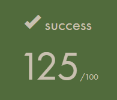

# 🛡️ Born2beroot

**Born2beroot** es un proyecto del campus 42 cuyo objetivo es configurar un servidor Linux virtual desde cero siguiendo una serie de requisitos estrictos de seguridad y administración. Fue realizado en entorno Debian y virtualizado con VirtualBox.



---

## 🎯 Objetivos del proyecto

- Configurar un servidor Linux (Debian o Rocky Linux).
- Uso obligatorio de particiones cifradas con LVM.
- Configurar usuarios, grupos y políticas de contraseñas fuertes.
- Configurar firewall (UFW o firewalld).
- Activar AppArmor o SELinux según distribución.
- Instalar y asegurar el acceso por SSH (puerto 4242).
- Evitar acceso SSH al usuario root.
- Implementar script `monitoring.sh` para mostrar estadísticas del sistema.

---

## ⚙️ Script `monitoring.sh`

El script muestra información del sistema cada 10 minutos usando `cron` y `wall`. Algunos de los datos que imprime:

- Arquitectura del sistema y versión del kernel
- Número de CPUs físicos y virtuales
- Uso de memoria RAM y disco
- Carga actual de CPU
- Fecha del último reinicio
- Uso de LVM
- Número de conexiones TCP activas
- Usuarios conectados
- Dirección IP y MAC
- Número de comandos ejecutados con `sudo`

Ejemplo de salida:
```bash
#Architecture: Linux malvarde 6.1.0-18-amd64 x86_64
#CPU physical: 1
#vCPU: 2
#Memory Usage: 512 / 2048 MB (25.00%)
#Disk Usage: 20G / 8G (40%)
#CPU load: 5.5 %
#Last boot: 2024-04-01 08:42
#LVM use: yes
#TCP Connections: 3 ESTABLISHED
#User log: 2
#Network: IP 10.0.2.15 (08:00:27:xx:xx:xx)
#Sudo: 42 cmd
```

---

## 📸 Resultado


---

## 🧑‍💻 Autor

**👨‍💻 alvdelga** - Estudiante en 42 Madrid  
[GitHub Profile](https://github.com/alvdelga)

---

## ✅ Estado del proyecto

> Proyecto completado con éxito y nota **125/100**