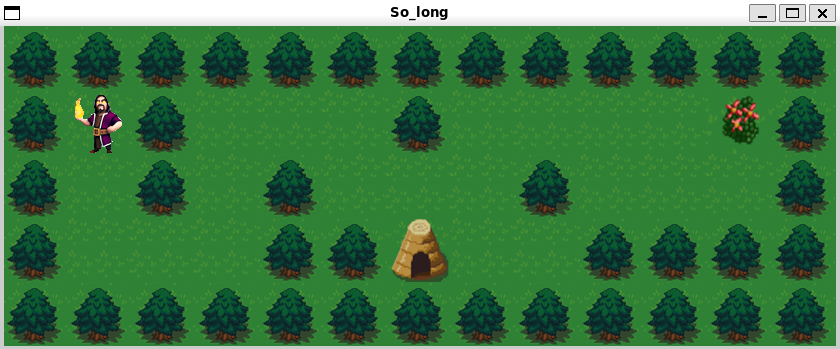

# 🕹️ So_long

**So_long** es un proyecto del campus 42 Madrid desarrollado en C usando la librería gráfica [MiniLibX](https://harm-smits.github.io/42docs/libs/minilibx). El objetivo del proyecto es crear un pequeño videojuego en 2D donde el jugador pueda moverse por un mapa, recolectar objetos y llegar a la salida.



---

## 🎯 Objetivo del juego

- Mover al jugador con las teclas `W`, `A`, `S`, `D` o flechas.
- Recolectar todos los objetos (`C`) en el mapa.
- Llegar a la salida (`E`) una vez recogidos todos los objetos.

Si el jugador intenta salir antes de recoger todos los coleccionables, el juego lo impedirá.

---

## 📁 Estructura del proyecto

```
So_long/
├── ft_printf/         # Implementación propia de printf
├── gnl/               # get_next_line para lectura de archivos
├── maps/              # Mapas de ejemplo .ber
├── minilibx-linux/    # Librería gráfica
├── src/               # Código fuente del juego
├── textures/          # Imágenes del juego (.xpm)
├── Makefile
└── README.md
```

---

## 🧠 Funcionalidades destacadas

- Carga y validación de mapas `.ber`
- Detección de errores de formato y caracteres inválidos
- Movimiento del jugador con gestión de colisiones
- Conteo de movimientos y objetos restantes
- Uso de sprites y renderizado con MiniLibX
- Liberación manual de memoria y recursos gráficos

---

## 🧪 Cómo compilar y ejecutar

### 🔧 Requisitos

Asegúrate de tener las siguientes librerías instaladas:

```bash
sudo apt install libx11-dev libxext-dev libbsd-dev
```

### ▶️ Compilación y ejecución

```bash
make
./so_long maps/mapa.ber
```

---

## 🧊 Controles

| Tecla        | Acción             |
|--------------|--------------------|
| `W` / `↑`    | Mover arriba       |
| `A` / `←`    | Mover izquierda    |
| `S` / `↓`    | Mover abajo        |
| `D` / `→`    | Mover derecha      |
| `ESC`        | Salir del juego    |

---

## 🖼️ Captura de pantalla


---

## 📌 Autor

- 👨‍💻 **alvdelga** - Estudiante de 42 Madrid